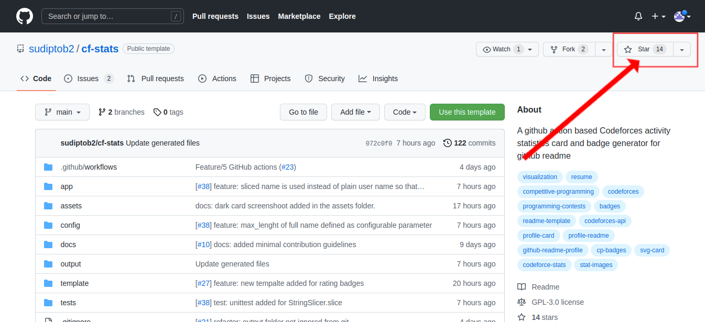
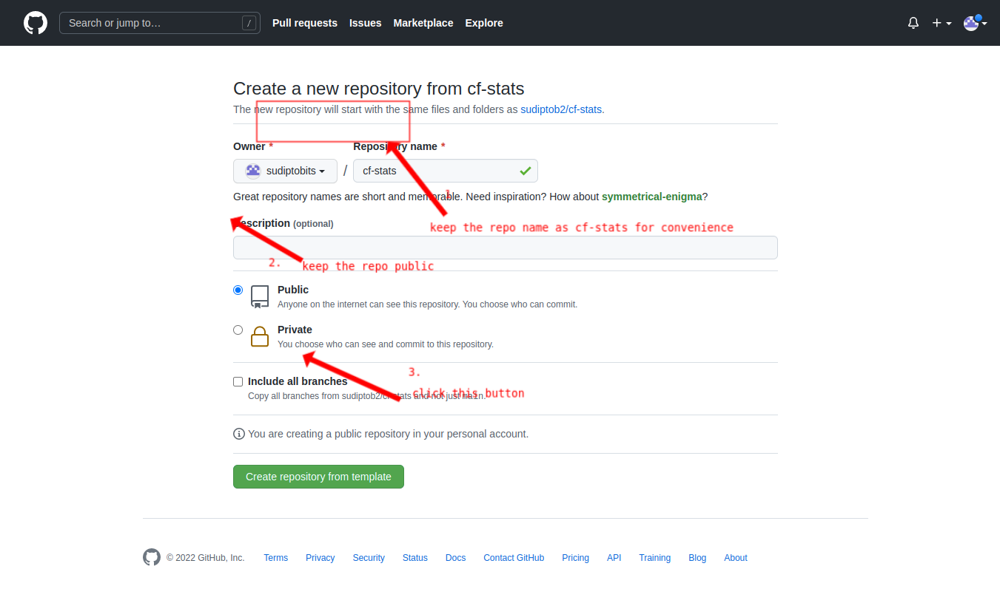
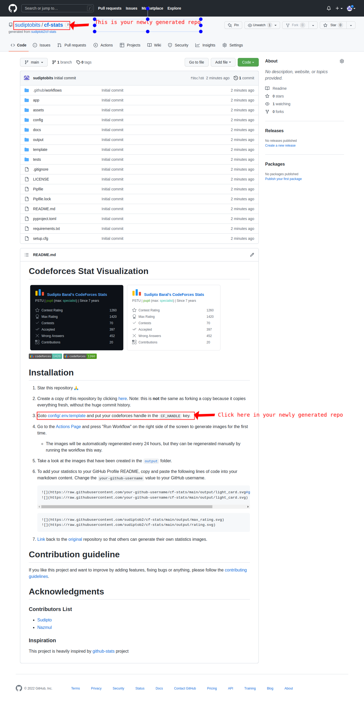
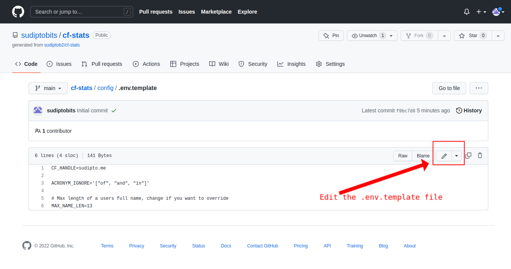
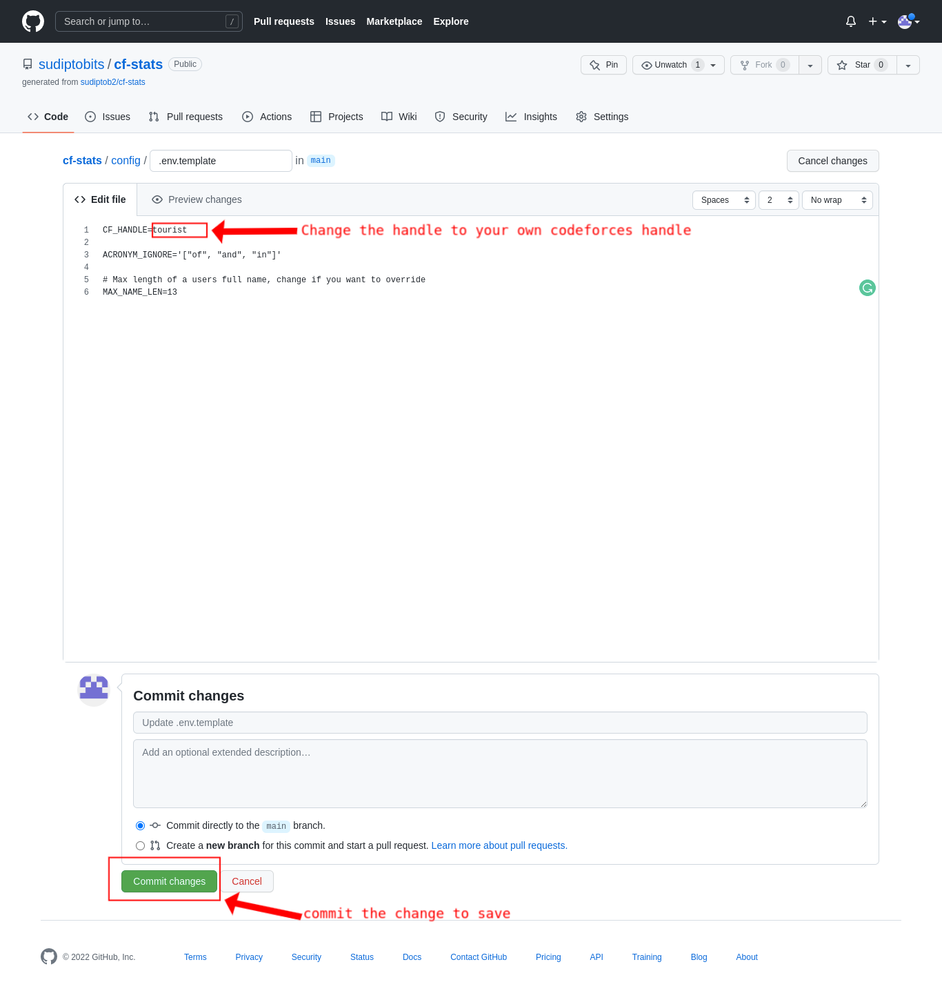
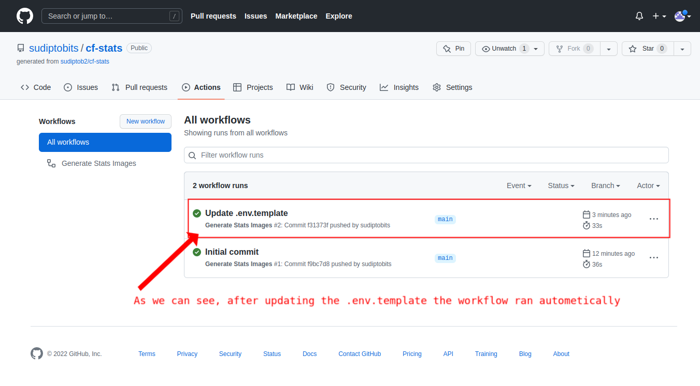
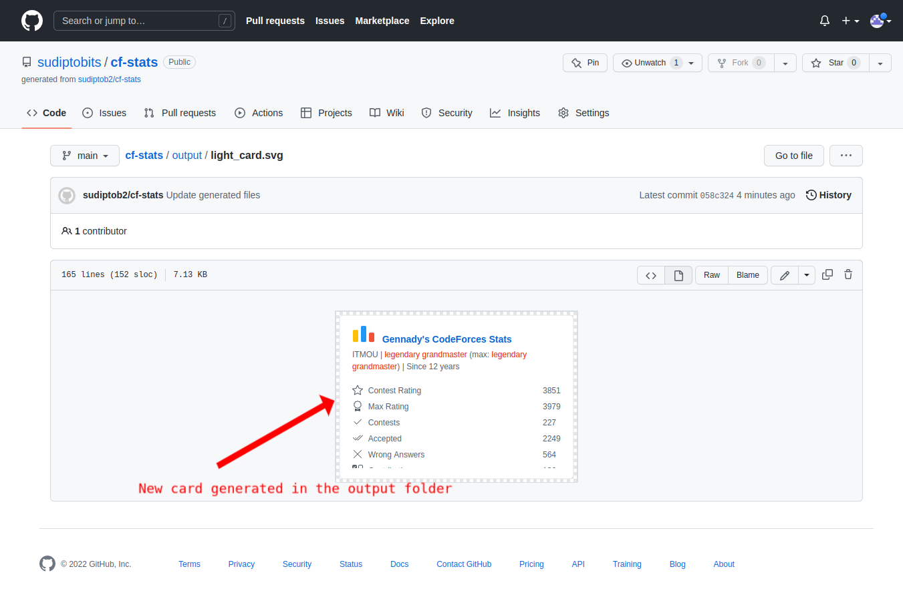

# Installation
1. Star this repository :pray:



2. Create a copy of this repository by clicking
   [here](https://github.com/sudiptob2/cf-stats/generate). Note: this is
   **not** the same as forking a copy because it copies everything fresh,
   without the huge commit history.



3. Goto [config/.env.template](../config/.env.template) and put your codeforces handle in the `CF_HANDLE` key.







4. Go to the [Actions Page](../../actions?query=workflow%3A"Generate+Stats+Images") and press "Run Workflow" on the
   right side of the screen to generate images for the first time.
    - As we updated the `CF_HANDLE` just now, so the workflow automatically ran.
   

   
5. Take a look at the images that have been created in the
   [`output`](../output) folder.



6. To add your statistics to your GitHub Profile README, copy and paste the
   following lines of code into your markdown content. Change the `your-github-username`
   value to your GitHub username.

   ```md
   
   
   ```
   ```md
   
   
   ```